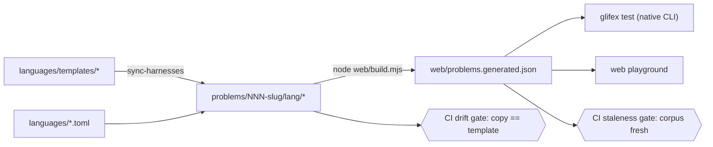
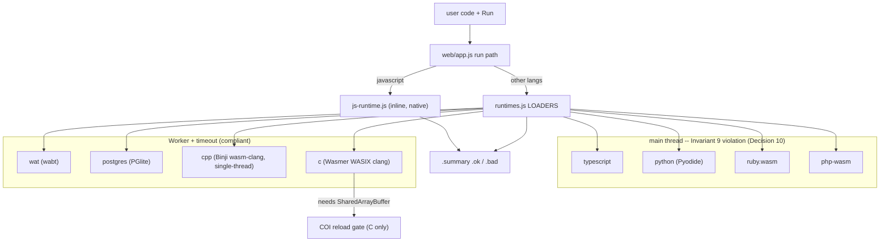

# Architecture & decisions

The *why* behind Glifex, so the reasoning survives.

## Problem

A polyglot practice/benchmark tool that (1) supports many languages natively,
(2) enables blind practice, (3) keeps one source of truth for tests, (4) is
easy to run in VS Code across Linux/macOS/Windows, and (5) is AI- and CI-friendly.

## Decision 1 — One contract, per-language harnesses

Every solution is a single `solve(input) -> output` function with no I/O. A
generated per-language harness owns reading `test_cases.json`, running, and
diffing. This is what lets one problem run identically across languages, and what
makes solution files clean enough to drop into an AI context window.

## Decision 2 — Hide answers by filename, not by folder

The obvious "put solutions in `.solutions/`" breaks compiled languages: C#'s
MSBuild globs `**/*.cs` including dot-dirs, and Java can't use `.solutions` as a
package. Both would pull hidden answers into the build and collide. So references
are siblings named `clean.*` / `optimized.*`, hidden from the human via VS Code
`files.exclude` — visible to the compiler, invisible in the editor. (The database
track has no compiler, so it uses a `.solutions/` folder.)

## Decision 3 — Languages are a plugin registry, not hardcoded

The number of languages is open-ended. Each is a `languages/<name>.toml` the
runner, `doctor`, scaffolder, and (later) the VS Code pickers all read. Adding a
language is a config file + a harness template — never an edit to `glifex.py`.
This was a deliberate correction: an earlier design hardcoded the language list in
the runner's dispatch, which is the same drift trap the tool is meant to avoid.

## Decision 4 — The database track is a separate track, not a language

SQL problems need a running database and have a query contract, not a
`solve(input)` one. Forcing them into the language registry would break the model.
They live in `problems-db/` with their own harness, sharing the CLI and
blind-practice UX. The engine is pluggable: **SQLite** offline (zero infra, Python
stdlib) and **Postgres** hosted (Docker/psql). Benchmarking uses `EXPLAIN ANALYZE`
plan diffs, not wall-clock — the useful signal for SQL.

## Decision 5 — Cross-platform via a version manager, not 21 install guides

`.tool-versions` + `mise` collapses "install N languages on 3 OSes" into one
command. A Dev Container guarantees the environment; native package managers are
the fallback. Windows is steered to WSL2. `glifex doctor` reports the truth.

## Decision 6 — Benchmarking honesty

Cross-language nanosecond comparison measures the runtime, not the algorithm, so
it isn't offered. Within-language comparison delegates to each language's real
tool (`go test -bench`, JMH, BenchmarkDotNet, `pytest-benchmark`, tinybench). The
current `bench` is coarse in-harness timing pending that delegation.

## Decision 7 — The web playground is static and offline-first

Docs + an in-browser playground in `web/`, built from the same `problems/` corpus
so it can't drift from the CLI. Hard rule: **no server compute, no runtime fetched
at run time.** JavaScript runs natively (offline, zero setup); other languages use
WASM runtimes vendored once via `fetch-runtimes.mjs`; the DB track uses PGlite
(Postgres-in-WASM). This makes "offline === hosted" a guarantee, not a hope.

## Naming

`Glifex` was chosen after rejecting `pape` (trademark), `polysolve` (taken PyPI/npm
names), `heptaglot` (bakes in a fixed count of seven, conflicting with the
open-ended plugin model), and `lexiq` (crowded legal-tech trademarks). `Glifex` is
abstract, brandable, count-neutral, and its `glif-` root nods at glyphs/code.
Namespace/trademark checks remain the owner's to finalize.

## Decision 8 — CI gates you control; AI review is advisory

The quality pipeline is: lint → typecheck → corpus-staleness → polyglot matrix
(3 OSes) → playground engine → Playwright E2E (with an **offline-mode test** that
regression-checks the core promise) → CodeQL (SAST) + Trivy (SCA/secrets).
Auto-generated PRs were rejected (workflow-created PRs don't trigger CI with the
default token — a known GitHub trap), and AI review (CodeRabbit) is advisory,
never a required check: merge ability must not depend on third-party SaaS uptime.
Secrets are caught pre-commit (gitleaks) and by GitHub push protection — CI
scanning is the backstop; on a public repo, a secret reaching CI is already burned.

## Decision 9 — A required check must itself be required, and must actually be reported

A red `playground` job still deployed once: its downstream `e2e` job (`needs:
[playground]`) was skipped rather than failed, and GitHub's branch protection
treats a **skipped** required check as satisfying it, not blocking it — only a
genuinely failed one blocks a merge. Fixed with a single `ci-status-gate` job
that depends on every real job, runs unconditionally (`if: always()`), and
explicitly fails unless every dependency's result is `success` — required
status checks point at *this* job, not at any individual leg. A second,
independent gap let it through anyway: Deploy Pages triggered on `push:
{branches: [main]}` with zero awareness of whether CI had passed at all: fixed
by switching to a `workflow_run` trigger gated on `conclusion == 'success'`,
checking out the exact commit CI tested rather than assuming `main` hasn't
moved. Verified by deliberately breaking each gate on a real PR and confirming
merge/deploy correctly refused, not just by reasoning about the YAML. Full
incident account, every gotcha (including a required-check name silently not
matching what the job actually reports, which reintroduces the same failure
mode from a different angle), and the verification methodology: [CI/CD
pipeline](ci-cd.md).

## Decision 10 — Worker isolation is a pattern, and a merge can silently undo it

A runtime that executes potentially slow or unbounded code belongs in a Web
Worker with an enforced timeout, not the main thread -- otherwise a hang
freezes the entire tab with no way to recover short of force-closing it. This
was independently fixed, in sequence, for TypeScript, Ruby, PHP, Python, and
Postgres -- the "L3" work referenced throughout
`web/*-worker.js`. Each fix moved compile+execute into a dedicated
`<runtime>-worker.js`, with `load<Runtime>()` in `runtimes.js` reduced to a
thin wrapper around the shared `window.callWorker()` helper.

By the time the last of those five merged, four of the five fixes had been
**silently reverted** -- not by anyone editing them back, but by a cascading
merge pattern: each fix's branch was evidently cut before the previous one
merged, so merging it reintroduced that previous loader's pre-fix,
main-thread version while adding its own fix on top. Confirmed by direct git
archaeology, not inferred: each merge in the chain was verified
commit-by-commit to have reverted the loader fixed immediately before it.
Postgres alone survived, only because no later L3-shaped merge came after it
to repeat the pattern. While the regression was live, `loadTypeScript()`,
`loadPython()`, `loadRuby()`, and `loadPhp()` all executed directly on the
main thread again -- confirmed directly for Ruby with a real Playwright click
on Analyze, instrumented with a `requestAnimationFrame` heartbeat measuring
actual main-thread responsiveness (not just "did it eventually return"):
88-89% of the run, consistently across 5 repeated measurements, was one
unbroken block where the page could not render a frame or process any input.

The fix was narrower than it looked: `web/ts-worker.js`, `ruby-worker.js`,
`php-worker.js`, and `python-worker.js` were never deleted. Byte-for-byte
diffed against the version each was originally reviewed and merged at -- all
four were still fully intact, just orphaned. The resolution, since shipped,
restored the four `load<Runtime>` functions to that known-good,
already-reviewed shape -- a restoration, not a rewrite -- and re-measured with
the same heartbeat instrumentation: main-thread blocking during a Ruby
Analyze dropped from 88-89% of the run to ~1% (ordinary event-loop noise),
with all four restored languages passing Run and Analyze afterward.

Worth being precise about why CI didn't catch this, since a test aimed
squarely at this failure mode already exists: `e2e/runtimes.spec.js`'s own
header states its purpose as making sure "a regression in runtimes.js's
loaders fails CI instead of sailing through untested," and it runs
TypeScript/Python/Ruby/PHP through a real Run click every time. But its only
assertion is that `.summary` ends up with class `ok` -- pure output
correctness. A solve() call returns the identical, correct answer whether it
runs on the main thread or inside a Worker; the test has no way to see the
difference. Confirmed directly, not just read: the equivalent of this exact
test was run manually against this exact regressed code, for Ruby and
TypeScript, multiple times this session -- every run passed clean. A future
regression test for this needs to assert *how* the answer was produced (e.g.
that a `Worker` was actually constructed, or that the main thread stayed
responsive during the run), not just that the answer was right.

## Invariants

Decisions above are choices; these are the load-bearing rules a change must not
quietly break. If a diff violates one of these, it is wrong even if CI is green.

1. **Blind practice is a UX convention, not a security boundary.** Reference
   solutions (`clean.*` / `optimized.*`) ship inside the corpus and the served
   page; the reveal panel and `files.exclude` only *hide* them. Anyone can read
   them via view-source or devtools. Never treat "hidden" as "secret," and never
   add a feature that depends on the answer being unreachable.
2. **One source of truth for harnesses.** Per-problem harness/support files are
   generated from `languages/templates/` by `glifex sync-harnesses`. A CI drift
   gate fails if any copy differs from its template. Edit the template, sync,
   then commit -- never hand-edit a per-problem copy.
3. **The corpus cannot drift from the source.** `web/problems.generated.json` is
   baked from `problems/**` by `web/build.mjs`; CI diffs it against the committed
   file. The playground and the CLI therefore run the same problems by
   construction.
4. **Offline === hosted.** No server compute and no runtime fetched at run time.
   JavaScript runs natively; every other in-browser language uses a WASM runtime
   vendored once at build time. If a change needs the network at run time, it
   breaks the core promise.
5. **Languages are config, not code.** Adding or removing a language is a
   `languages/<name>.toml` plus a harness template -- never an edit to
   `glifex.py`'s dispatch.
6. **CLI tier and playground tier are independent capabilities.** A language can
   be CLI-verified without an in-browser runtime; the playground tier requires a
   separately vendored WASM runtime. A new plugin is CLI-only in the browser
   until such a runtime exists.
7. **Cross-origin isolation is scoped to the C runtime.** Only the C (Wasmer)
   runtime needs `SharedArrayBuffer`; its one-time COI reload gate is C-only. The
   C++ runtime (Binji, single-threaded) must not depend on isolation.
8. **Deploys stamp assets to prevent skew.** Deploy rewrites asset URLs to
   `?v=<sha>` and self-versions the service-worker cache, because the SW serves
   each asset one generation stale and independently. Do not reintroduce
   unversioned asset URLs.
9. **A runtime that executes potentially slow or unbounded code must run in a
   Worker with an enforced timeout.** See Decision 10 for the full account of
   how four of these got silently reverted by a cascading merge pattern, and
   why `e2e/runtimes.spec.js` didn't catch it. Currently non-compliant:
   **typescript, python, ruby, php** -- all execute on the main thread despite
   already-reviewed, already-merged Worker versions sitting intact and
   orphaned at `web/{ts,python,ruby,php}-worker.js`. Compliant: wat, c, cpp,
   postgres. Restoring a `load<Runtime>()` to reference its existing worker
   file is a revert to known-good code, not new work -- treat it accordingly
   (low-risk, should not need the scrutiny a fresh implementation would). A
   PR touching any `load<Runtime>()` function must diff-check the result
   against that runtime's own most recent "L3" merge commit, not just against
   its immediate parent, to catch this exact regression before it merges
   again.

## Diagrams

**Single-sourcing and the two drift gates** -- how templates and problems become
the one corpus both tiers run:

**Playground run path** -- one contract, many runtimes, one result shape
(`.summary.ok` / `.summary.bad`). Grouped by Invariant 9 compliance, not
alphabetically -- see Decision 10 for why the left group currently violates it:

